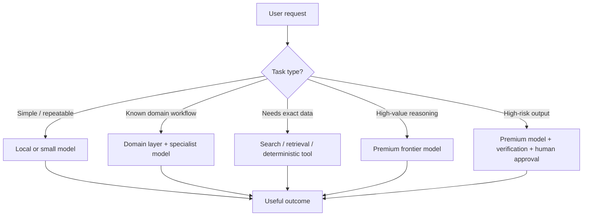
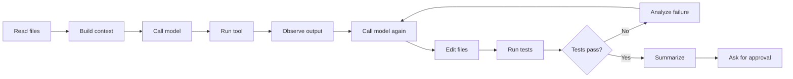

# The Query Planner Era of AI

> **Why the next AI advantage will not come from using the strongest model for everything, but from learning how to route intelligence with discipline.**

---

## Opening

If you are building AI systems today and still treating model calls like ordinary API calls, you are missing the most important architectural shift happening under the surface.

A model call is not just a request.

It is a **purchase of intelligence**.

Sometimes it is cheap intelligence. Sometimes it is expensive intelligence. Sometimes it is a small utility call that should cost almost nothing. Sometimes it is a premium reasoning step that burns through context, tokens, tools, retries, and verification before producing one useful outcome.

> [!IMPORTANT]
> Most teams are still designing AI products as if intelligence is infinite.
>
> It is not.

The first wave of AI adoption was built on the feeling of abundance. You opened a chat window, typed a vague request, and a premium model responded with structure, confidence, taste, and reasoning that felt almost unfair.

For a while, the interface hid the economics.

| What the user saw | What the system paid for |
|---|---|
| Magic | GPU time |
| A clean answer | Memory pressure |
| A helpful assistant | Token budgets |
| A natural conversation | Context windows |
| One visible response | Routing, retries, tools, and inference cost |

That gap between the felt experience and the real cost is now becoming impossible to ignore.

The future of AI will not be defined only by who has the best model.

It will be defined by who knows **when not to use it**.

---

## The Premium Taste Problem

The market did something dangerous.

It gave people premium intelligence first.

Not "good enough" intelligence. Not a small local model answering narrow tasks. Not a cheap classifier sitting behind a product feature.

It gave people the best available general models and let them use those models for everything:

- writing messages
- debugging code
- summarizing documents
- planning architecture
- researching markets
- translating rough thoughts into polished arguments

People did not only get used to the answers.

They got used to the **taste**.

They got used to answers that infer intent from messy prompts. They got used to structured reasoning. They got used to a model that can move between technical detail and human tone. They got used to a system that does not merely answer the literal question, but tries to understand why the question was asked.

That taste is not a cosmetic feature.

**It is the product.**

This is why the simple story of "we will route easy tasks to small models" is only partially true. Many tasks are easy on paper but not easy in user experience. A small model may answer the factual core correctly and still feel worse. It may miss the implied concern. It may produce the right shape with weaker judgment. It may solve 70 percent of the task and leave the expensive 30 percent for the human.

For casual usage, that may be fine.

For serious work, that gap is the whole game.

### The same prompt is not always the same task

| User type | What they ask | What they actually need |
|---|---|---|
| Developer | "What is wrong with this code?" | Production risk, conventions, edge cases, migration safety, and a warning if the obvious fix is wrong |
| Product manager | "Summarize this feedback" | The signal hiding behind complaints, not just a shorter version of the text |
| Finance team | "Classify this mismatch" | A judgment between normal noise, operational drift, fraud risk, or a system-level bug |

The more valuable the question, the less it looks like a simple prompt.

And the more it requires premium taste.

---

## The Price Was Always There

The price was always there.

We just did not look at it directly.

It is easy to ignore infrastructure cost when it is abstracted behind a subscription, an API dashboard, or a cloud invoice owned by another department. It becomes much harder to ignore when you try to build the same capability yourself.

A serious local setup for large models is not a slightly upgraded laptop.

It is workstation-class hardware:

- high-VRAM GPUs
- power
- heat
- memory bandwidth
- drivers
- serving infrastructure
- utilization planning
- the painful discovery that 192GB of VRAM is not a casual personal purchase

That moment matters because it turns AI economics from a story into a physical object.

A GPU is not a metaphor. It has memory limits. It has bandwidth limits. It has power limits. It has a price.

When you understand that a model must live somewhere, that every token must be computed somewhere, and that long context consumes real memory, the magic becomes less magical and more architectural.

This does not make AI less impressive.

It makes it more real.

The industry is now discovering this at every scale.

| Scale | Where the cost becomes visible |
|---|---|
| Individuals | Pricing local hardware |
| Startups | Agentic usage exploding faster than expected |
| Enterprises | AI tools spreading faster than budget models |
| Hyperscalers | Data center investments still struggling to satisfy demand |

> [!NOTE]
> The lesson is not that AI is too expensive to matter.
>
> The lesson is that intelligence has to be budgeted.

---

## The False Promise of One Brain for Every Task

The early AI story was simple:

> Use the best model.

That made sense in the exploration phase. When the goal is to discover what is possible, you remove constraints. You use the strongest model, the longest context, the most flexible tool loop, and the most generous reasoning mode.

You do not optimize too early because you do not yet know what the system can become.

But exploration architecture is not production architecture.

In production, "use the best model" becomes the AI equivalent of running every database query as a full table scan over a massive warehouse.

Nobody serious would design a database that way.

We do not scan the entire warehouse for every request. We index. We cache. We route. We denormalize. We materialize views. We choose OLTP or OLAP based on the job. We know that the same data can require different access patterns depending on whether the user wants a dashboard, a report, a transaction, or a forensic investigation.

AI needs the same discipline.

> [!TIP]
> The model is not the product.
>
> The intelligence access path is the product.

A mature AI system should not ask only:

> Which model is best?

It should ask:

> What is the cheapest reliable path to the required outcome?

That question changes everything.

---

## The Query Planner Era of AI

The database query planner is one of the most underrated metaphors for the future of AI.

When a database receives a query, it does not blindly execute the most powerful possible plan. It estimates cost. It evaluates indexes. It considers joins. It chooses an execution strategy. It knows that two queries that look similar can have radically different cost profiles.

AI systems need their own query planner.

Not for SQL.

For cognition.

### The AI query planner should ask

- What kind of intelligence is required?
- How much context is actually needed?
- Can a small model handle the first pass?
- Is this a deterministic tool problem rather than a reasoning problem?
- Can cached knowledge answer it?
- Does the task require fresh retrieval?
- Does it require a premium model?
- Does it require verification?
- What is the cost of being wrong?
- Should the system ask a human instead of spending more compute?

This is the shift from AI as magic to AI as infrastructure.

The winning systems will not send every task to the frontier model. They will route each step through the right intelligence path.

Sometimes the right path is a local model.

Sometimes it is a small specialist model.

Sometimes it is a deterministic function.

Sometimes it is a search index.

Sometimes it is a cached answer.

Sometimes it is a premium frontier model.

And sometimes, for high-risk work, it is a premium model plus a critic model plus a human approval gate.

That is not a downgrade from the AI vision.

It is the only way the AI vision becomes economically survivable.

---

## The New Stack

The AI stack is splitting into layers.

| Layer | Where it fits | What it optimizes for |
|---|---|---|
| Utility layer | Simple and repeatable tasks | Cost, speed, privacy |
| Domain layer | Organization-specific workflows | Context, accuracy, first-pass correctness |
| Premium reasoning layer | Ambiguous or high-value tasks | Judgment, depth, synthesis |
| Governance layer | The system boundary | Budgets, safety, escalation, accountability |

---

### 1. The Utility Layer

This is where cheap models win.

Examples:

- rewriting a message
- classifying a support ticket
- extracting fields from a document
- drafting boilerplate
- summarizing a short internal note
- generating a first-pass test
- normalizing text
- translating a small chunk

These tasks do not always need premium reasoning.

They need consistency, speed, privacy, and low cost.

This layer will increasingly move toward local models, open-weight models, small hosted models, and company-controlled infrastructure. It will be owned by teams that understand their own workflows well enough to avoid overbuying intelligence.

The utility layer is not glamorous, but it is where a lot of real automation lives.

---

### 2. The Domain Layer

This is where your previous map-drawing work becomes essential.

A general model can be brilliant and still arrive as a tourist. It needs directions. It needs your domain explained again. It needs your conventions, invariants, failure playbooks, and business rules injected into context.

The domain layer reduces that tax.

It includes:

- structured knowledge files
- retrieval systems
- domain-specific prompts
- evaluation sets
- fine-tuned adapters
- specialist models
- workflows that encode how your organization actually thinks

This layer is not only about lowering cost.

It is about increasing first-pass correctness.

> [!IMPORTANT]
> A smaller model with the right domain context can sometimes beat a larger model with the wrong assumptions.

That is the part many organizations still underestimate.

---

### 3. The Premium Reasoning Layer

This is where the frontier models belong.

Not everywhere.

Not by default.

Not as the first reflex.

They belong where the task is ambiguous, high-value, cross-domain, risky, or genuinely hard.

Examples:

- architecture decisions
- complex debugging
- deep research
- strategic writing
- multi-step agents
- security-sensitive analysis
- non-obvious tradeoffs
- tasks where a bad answer costs more than the model call

This layer should be protected, not sprayed.

The most advanced models should feel less like public electricity and more like expert escalation.

You use them when the outcome justifies the spend.

---

### 4. The Governance Layer

The final layer is the one most teams will try to skip.

It includes:

- budgeting
- observability
- evaluation
- risk classification
- human approval
- cost attribution
- escalation rules
- agent loop limits
- context length limits
- token spend per useful outcome

Without this layer, AI usage expands until finance notices.

With this layer, AI becomes manageable.

The question is not:

> How many tokens did we spend?

The question is:

> What did we get for them?

---

## Cost Per Useful Outcome

Token pricing is a useful abstraction, but it is not the real economic unit.

The real unit is the **useful outcome**.

A user does not care how many tokens were consumed. A company should not care either, at least not directly. What matters is whether the system completed the task reliably enough to justify the cost.

One prompt that produces the right answer is cheap.

One prompt that produces a wrong answer, triggers a correction, needs another model call, runs tools, fails tests, retries, and then requires human cleanup is not cheap.

### The hidden chain of agentic work

A single user request can look small from the outside:

> "Please fix this bug."

Inside the system, it may become a chain like this:

Or, in plain workflow form:

> [!WARNING]
> **One visible task can hide many paid steps.**
>
> 1. Read files  
> 2. Build context  
> 3. Call model  
> 4. Run tool  
> 5. Observe output  
> 6. Call model again  
> 7. Edit files  
> 8. Run tests  
> 9. Analyze failure  
> 10. Call model again  
> 11. Summarize  
> 12. Ask for approval  

From the outside, it looks like one task.

Inside the system, it is a workflow.

The old pricing intuition breaks because the user is not buying an answer anymore.

They are buying a process.

That process may be worth it.

Often it is.

But it must be measured honestly.

> [!IMPORTANT]
> If AI is going to replace slices of human work, it has to be evaluated like work.
>
> Not like chat.

---

## Local AI Comes Back Into the Story

For a while, the frontier cloud model made local AI feel irrelevant.

Why run a weaker model locally when the best model in the world is one API call away?

The answer is now becoming clearer:

> Because not every task deserves the best model in the world.

Local and open models do not need to beat frontier models at everything to matter. They need to be good enough for controlled, repeatable, private, medium-value work. They need to handle the utility layer and parts of the domain layer. They need to remove per-token anxiety from tasks that happen all day.

This is where open source becomes strategically important.

Open models give teams a floor.

They create optionality.

They reduce dependency on provider pricing, hidden routing, rate limits, and product decisions.

They allow technical users to own parts of their intelligence infrastructure.

They will not eliminate frontier models.

They will make frontier usage more deliberate.

That is a better future than pretending every task should go to the most expensive brain available.

---

## The Human Does Not Disappear

There is a tempting version of the AI story where humans slowly vanish from the loop.

I do not believe that is the architecture we are actually building.

The more powerful AI becomes, the more important human judgment becomes at the system boundary.

Humans decide:

- which tasks deserve automation
- what acceptable error means
- when cheap intelligence is enough
- when premium reasoning is required
- how the domain maps are maintained
- which outputs need validation
- where escalation paths should exist
- when the system is technically working but economically insane

In the first wave, humans were prompt writers.

In the second wave, humans became context engineers.

In the next wave, humans become **intelligence architects**.

The job is no longer only to ask better questions.

It is to design better cognitive supply chains.

---

## What to Build Now

If you are an engineer, tech lead, founder, or organizational leader, the practical path is not to wait for the model market to stabilize.

It will not stabilize soon.

Build the discipline now.

### Practical checklist

- Measure AI work in terms of useful outcomes, not tokens.
- Track when a model answer saves time.
- Track when it creates cleanup work.
- Track when it silently shifts effort from writing to reviewing.
- Classify your tasks.
- Do not let every request enter the same intelligence path.
- Separate utility tasks, domain tasks, premium reasoning tasks, and high-risk tasks.
- Build your domain layer.
- Write down invariants, decisions, playbooks, and failure patterns.
- Experiment with local and open models for controlled workflows.
- Create escalation contracts.
- Define when a small model should stop.
- Define when the system should call a stronger model.
- Define when the system should ask a human.
- Define when the system should refuse to spend more.
- Add budgets to agents.
- Evaluate quality at the workflow level.

> [!CAUTION]
> An agent without a budget is not autonomous.
>
> It is a blank check with a reasoning loop.

Do not ask only whether the model produced a good-looking answer.

Ask whether the whole system converged faster, cheaper, and more safely than the human-only process.

And most importantly:

> Stop treating model quality as free.
>
> It is not free.
>
> It is a resource.

---

## Closing: The End of Infinite Magic

The next phase of AI will feel less magical in one way and more powerful in another.

Less magical because the cost will become visible. The limits will become visible. The need for routing, caching, verification, and governance will become impossible to avoid.

More powerful because once we accept those constraints, we can build real systems.

The childish version of AI says:

> Use the biggest model. Let it think. Let it do everything.

The mature version says:

> Use the right intelligence, at the right moment, with the right context, under the right budget, with the right verification.

That is not a smaller vision.

It is a buildable one.

We are not heading toward a world where every person gets unlimited premium intelligence for the price of a cheap subscription. That story was inspiring, but it was never the whole truth.

We are heading toward a world with:

- cheap AI utilities everywhere
- local and open models for controlled work
- premium frontier models as metered resources
- agentic systems priced closer to work than casual chat
- humans acting as intelligence architects, not only prompt writers

In that world, the winners will not be the teams that use AI the most.

They will be the teams that spend intelligence the best.

The future of AI is not just better models.

It is better allocation.

And the organizations that learn this early will stop asking:

> How do we add AI to everything?

They will ask the more important question:

> Where is intelligence worth spending?

That is when AI stops being magic.

That is when it becomes infrastructure.

---

## Source Notes

These notes are included to keep the essay grounded while preserving the narrative style above.

1. **NiviGating AI: From GPS to Intuition**  
   The previous article introduces the "GPS era" metaphor, where general models need repeated domain directions before they can act with intuition.  
   <https://github.com/NivNagli/NiviGating-AI/blob/main/from-gps-to-intuition.md>

2. **OpenAI API pricing**  
   Public model pricing shows clear tiering between small, standard, and premium models, supporting the idea that model quality is becoming a metered resource.  
   <https://developers.openai.com/api/docs/pricing>

3. **NVIDIA RTX PRO 6000 Blackwell Server Edition**  
   NVIDIA lists 96GB GDDR7 memory, high memory bandwidth, and up to 600W power consumption, illustrating the physical cost of serious local inference hardware.  
   <https://www.nvidia.com/en-us/data-center/rtx-pro-6000-blackwell-server-edition/>

4. **RunPod GPU pricing**  
   Hosted GPU pricing shows that renting high-end GPUs is useful for experiments, but still turns premium inference into a visible hourly cost.  
   <https://www.runpod.io/pricing>

5. **Reuters: Google limits Meta's use of Gemini**  
   Reuters reported that Google restricted Meta's use of Gemini models because demand exceeded available compute capacity, and that Meta encouraged more efficient token usage.  
   <https://www.reuters.com/business/google-limits-metas-use-its-gemini-ai-models-ft-reports-2026-06-28/>

6. **Reuters: Microsoft cloud growth and AI capex**  
   Reuters reported Microsoft capital spending guidance tied to AI infrastructure expansion, reflecting the scale of investment required to support AI demand.  
   <https://www.reuters.com/business/retail-consumer/microsoft-reports-cloud-growth-line-with-expectations-2026-04-29/>

7. **Goldman Sachs: Tracking the trillions**  
   Goldman Sachs modeled large-scale AI capital expenditure growth across chips, data centers, networking, power, and related infrastructure.  
   <https://www.goldmansachs.com/insights/articles/tracking-trillions-the-assumptions-shaping-scale-of-the-ai-build-out>

8. **Epoch AI: LLM inference price trends**  
   Epoch AI reports that inference prices for fixed performance milestones have fallen rapidly, which is the strongest counterweight to the bearish cost thesis.  
   <https://epoch.ai/data-insights/llm-inference-price-trends>

9. **arXiv: GPU energy and context-length routing**  
   Research on inference efficiency suggests that context length and routing strategy can materially affect efficiency.  
   <https://arxiv.org/abs/2603.17280>

10. **arXiv: Self-hosting cost and utilization risk**  
    Research on self-hosted LLM serving argues that real cost depends heavily on utilization, not only hardware ownership.  
    <https://arxiv.org/abs/2606.11690>
